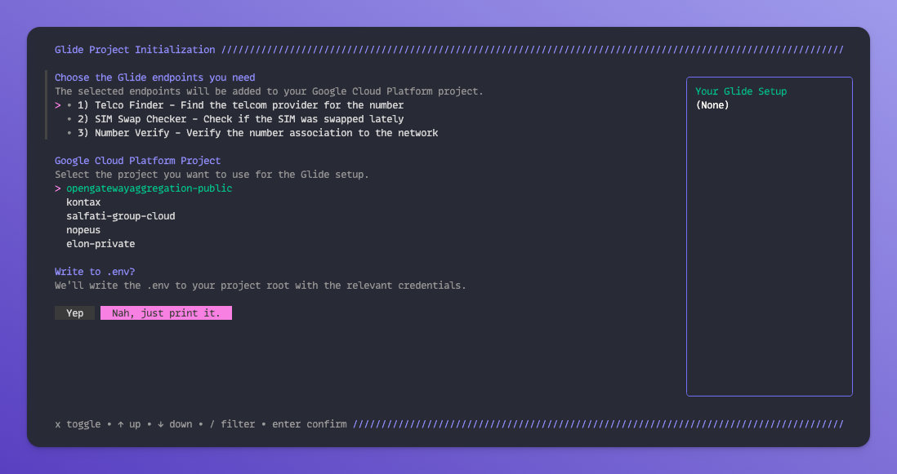

# Glide

Glide is your single API to connect with every telecom in the world.

## What is it for?

The Gldie CLI is here to help you onboard and extend your codebase to connect you with the gateway as simply as possible.

## Install

There are multiple ways to install the CLI:

**Homebrew Tap**

```console
$ brew install ClearBlockchain/tap/glide
```

**Go Install**

```console
$ go install github.com/ClearBlockchain/onboarding-cli@latest
```

## Quick Start

To get your Glide credentials follow the steps after running:

```console
$ glide init
```



This will provide you with your Client ID, and Client Secret which we recommend storing as environment variables.
